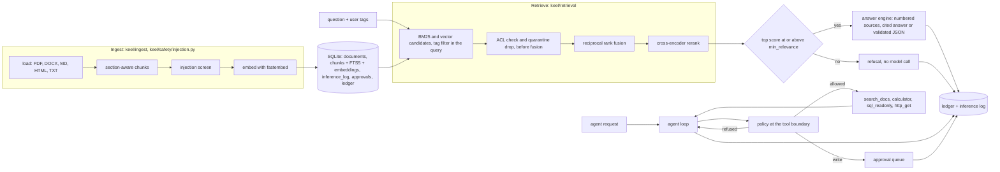
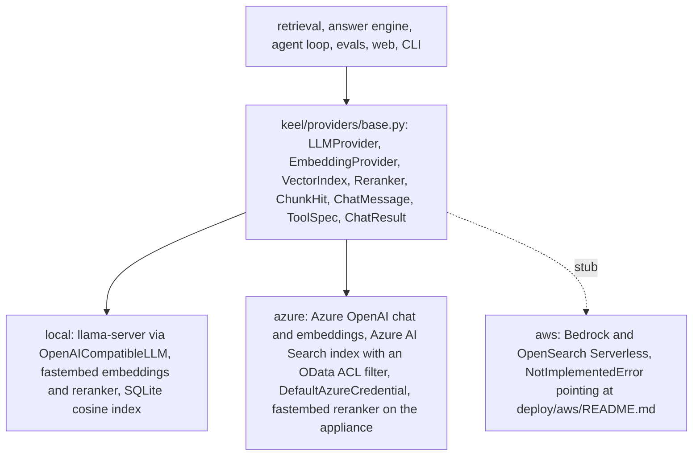

# Keel

Keel is a sovereign retrieval and agent appliance, built security-first. Documents go in with ACL
tags and answers come out citing the exact chunks they came from. Everything stays in the building.

One Python codebase runs the whole appliance, on a single on-premise machine or inside a client's
own Azure tenancy with managed identity and zero keys, and behaves the same way in both. Permission
filtering happens inside retrieval, before generation. The agent calls typed tools under a written
policy, write actions wait in an approval queue for a person, every request lands in a hash-chained
ledger and an inference log, and a golden-set evaluation with a regression gate ships in the same
repository, so quality is measured rather than asserted. Before first publish the security-bearing
paths were adversarially reviewed: 105 attack tests across access control, tool policy, ledger
integrity, injection screening and the air gap, and 27 findings. Twenty-five are fixed in the same
release, each with the test that proves it. Two stay open on purpose, one medium and one low, each
carrying the control that covers it and a strict expected-failure marker that says so the day it
starts passing (the full table is in [`docs/security-review.md`](docs/security-review.md)). It exists
because small Australian businesses and public bodies want to ask questions of their own documents
while the documents, and the questions, stay in the building.

Version 0.1.0. Apache 2.0.

## What it does

Each control names the code that implements it and the test that proves it. Every test below runs
without a model server or a network connection; the integration tests in
[`tests/test_e2e.py`](tests/test_e2e.py) add a live pass against llama-server when one is listening.

| Control | Implemented in | Proved by |
| --- | --- | --- |
| Permission filtering before generation: every chunk carries ACL tags, every request carries a user with tags, and chunks outside the user's tags are dropped from both candidate lists inside retrieval, before fusion, so nothing outside the user's tags reaches the reranker or the model | [`keel/retrieval/hybrid.py`](keel/retrieval/hybrid.py) (`allowed`, `Retriever.retrieve`), [`keel/retrieval/bm25.py`](keel/retrieval/bm25.py), [`keel/providers/local_index.py`](keel/providers/local_index.py) | [`tests/test_retrieval.py`](tests/test_retrieval.py)`::test_public_user_never_sees_the_hr_document`, `::test_retriever_drops_unentitled_and_quarantined_hits_before_fusion`; [`tests/test_answer.py`](tests/test_answer.py)`::test_acl_filtered_hits_lead_to_refusal` |
| Refusal below the relevance line, with zero model calls: when the best entitled chunk scores under `min_relevance` the engine answers "That is not in the documents I have access to." | [`keel/answer/engine.py`](keel/answer/engine.py) (`AnswerEngine.answer`) | [`tests/test_answer.py`](tests/test_answer.py)`::test_refuses_without_calling_llm_when_top_score_is_below_min_relevance`, `::test_refuses_without_calling_llm_when_nothing_retrieved` |
| Citations resolved to real chunks: `[n]` markers map to the numbered sources the model saw; an uncited answer gets its top two sources attached; out-of-range numbers are dropped | [`keel/answer/engine.py`](keel/answer/engine.py) (`resolve_citations`, `top_citations`) | [`tests/test_answer.py`](tests/test_answer.py)`::test_grounded_answer_maps_citations_to_chunks`, `::test_out_of_range_citation_numbers_are_dropped` |
| JSON mode: the answer is validated against a caller-supplied schema with one retry; a second invalid reply is reported as an error rather than passed through | [`keel/answer/engine.py`](keel/answer/engine.py) (`_answer_json`), [`keel/answer/schema.py`](keel/answer/schema.py) | [`tests/test_answer.py`](tests/test_answer.py)`::test_json_mode_invalid_then_valid_on_retry`, `::test_json_mode_still_invalid_after_retry_reports_error` |
| Indirect prompt-injection quarantine at ingest: weighted heuristics plus an optional LLM judge flag a chunk, which is stored `quarantined = 1`, kept out of both retrieval paths and out of the prompt, and listed on the admin page with the reason | [`keel/safety/injection.py`](keel/safety/injection.py), [`keel/ingest/pipeline.py`](keel/ingest/pipeline.py) (screen hook), [`keel/web/app.py`](keel/web/app.py) (release with a ledger row) | [`tests/test_safety.py`](tests/test_safety.py)`::test_planted_fixture_is_quarantined_with_reason`; [`tests/test_ingest.py`](tests/test_ingest.py)`::test_screen_hook_marks_quarantined_chunks`; [`tests/test_retrieval.py`](tests/test_retrieval.py)`::test_quarantined_chunk_is_excluded_from_both_paths` |
| Policy at the tool boundary: a per-deployment allowlist, argument rules (SELECT-only SQL over allowlisted tables under a read-only authoriser, HTTP host allowlist, arithmetic-only calculator), a call budget, and schema validation of every argument | [`keel/agent/policy.py`](keel/agent/policy.py), [`keel/agent/tools.py`](keel/agent/tools.py), [`keel/agent/loop.py`](keel/agent/loop.py) | [`tests/test_policy.py`](tests/test_policy.py)`::test_disallowed_tool_is_refused_with_a_reason`, `::test_sql_tool_is_read_only_at_the_connection`, `::test_calculator_rejects_everything_but_arithmetic`; [`tests/test_agent.py`](tests/test_agent.py)`::test_tool_call_budget_is_enforced` |
| Approval queue for write tools: a write call is stored `pending` and reported to the model as queued; it runs once, after a person approves, and every transition is a ledger row with the decider | [`keel/agent/approvals.py`](keel/agent/approvals.py), [`keel/agent/loop.py`](keel/agent/loop.py), [`keel/cli.py`](keel/cli.py) (`keel approvals`), [`keel/web/app.py`](keel/web/app.py) (approve and reject routes) | [`tests/test_agent.py`](tests/test_agent.py)`::test_write_tool_is_queued_and_never_executed`, `::test_approval_queue_decide_and_execute`; [`tests/test_web.py`](tests/test_web.py)`::test_admin_approve_executes_the_queued_ticket` |
| Air-gap mode: with `KEEL_AIRGAP=1` the process refuses outbound connections to any host outside loopback and the named allow list, at the socket, asyncio, urllib and httpx layers, before a packet leaves; the embedding models load from the local cache | [`keel/airgap.py`](keel/airgap.py) | [`tests/test_airgap.py`](tests/test_airgap.py)`::test_socket_connect_is_refused_before_the_original_runs`, `::test_httpx_transport_refuses_external_hosts_before_sending`, `::test_urllib_urlopen_refuses_external_hosts_before_any_handler`, `::test_asyncio_sock_connect_is_guarded` |
| Tamper-evident ledger: every request, retrieval set, tool call, tool result, answer, approval, ingest and quarantine change is a row whose SHA-256 covers its content and the previous hash; `keel verify-ledger` names the first broken link and an exported JSONL file verifies offline with the standard library | [`keel/safety/ledger.py`](keel/safety/ledger.py) | [`tests/test_safety.py`](tests/test_safety.py)`::test_ledger_tampered_payload_is_detected`, `::test_ledger_tampered_export_fails`; [`tests/test_cli.py`](tests/test_cli.py)`::test_verify_ledger_broken_chain_exits_1` |
| PII redaction with Australian formats: TFN, Medicare, ABN, card numbers, phone numbers and email addresses, check-digit validated so ordinary numbers pass | [`keel/safety/pii.py`](keel/safety/pii.py) | [`tests/test_safety.py`](tests/test_safety.py)`::test_tfn_valid_is_redacted_and_invalid_check_digit_is_not`, `::test_credit_card_luhn_valid_redacted_and_random_digits_not` |
| Inference log and admin page: one row per request with user, tags, retrieved chunk ids, tool calls, answer, citations, latency, tokens and judge scores; the admin page shows totals, a fourteen-day trend, recent requests, approvals, quarantine and ledger controls | [`keel/observe/log.py`](keel/observe/log.py), [`keel/web/app.py`](keel/web/app.py), [`keel/web/views.py`](keel/web/views.py) | [`tests/test_web.py`](tests/test_web.py)`::test_admin_page_lists_requests_totals_trend_and_sections`, `::test_admin_request_detail_shows_retrieval_citations_and_ledger`; [`tests/test_cli.py`](tests/test_cli.py)`::test_export_log_prints_json_lines_oldest_first` |
| Admin guard: admin routes are open on loopback and need the `X-Keel-Admin-Token` header beyond it; the source viewer refuses a chunk whose tags the caller lacks | [`keel/web/app.py`](keel/web/app.py) (`require_admin`, `source`), [`keel/web/views.py`](keel/web/views.py) (`is_loopback`) | [`tests/test_web.py`](tests/test_web.py)`::test_admin_guard_requires_token_beyond_loopback`, `::test_source_enforces_acl_tags` |
| Idempotent, ACL-tagged ingest of PDF, DOCX, Markdown, HTML and plain text with section-aware chunks; re-ingesting the same bytes adds nothing | [`keel/ingest/loaders.py`](keel/ingest/loaders.py), [`keel/ingest/chunk.py`](keel/ingest/chunk.py), [`keel/ingest/pipeline.py`](keel/ingest/pipeline.py) | [`tests/test_ingest.py`](tests/test_ingest.py)`::test_ingest_manifest_then_reingest_adds_nothing`, `::test_ingest_every_format_from_disk`, `::test_hr_document_chunks_carry_hr_tag` |
| Evaluation with a regression gate: a golden set runs through the production answer path, scores retrieval, refusals, leak strings and judged quality, writes HTML and JSON reports, and fails when a gated metric drops past its threshold | [`keel/evals/run.py`](keel/evals/run.py), [`keel/evals/metrics.py`](keel/evals/metrics.py), [`keel/evals/judge.py`](keel/evals/judge.py), [`keel/evals/report.py`](keel/evals/report.py) | [`tests/test_evals.py`](tests/test_evals.py)`::test_broken_retriever_zeroes_hit_at_3_refuses_everything_and_fails_the_gate`, `::test_must_not_include_catches_a_planted_override_string` |
| Cloud profile without keys: `DefaultAzureCredential` and a user-assigned managed identity; the Bicep template disables local key auth on Azure OpenAI and Azure AI Search | [`keel/providers/azure.py`](keel/providers/azure.py), [`deploy/azure/main.bicep`](deploy/azure/main.bicep) | [`tests/test_azure_provider.py`](tests/test_azure_provider.py)`::TestCredentials::test_chat_uses_default_azure_credential_when_no_client_is_injected`, `::TestAzureSearchIndex::test_search_builds_acl_filter_and_maps_hits`; CI `bicep build` and `bicep lint` |

The full suite is 602 tests across 19 files (`.venv\Scripts\python.exe -m pytest --collect-only -q`),
of which 174 are adversarial cases from the 105 attack tests in `tests/redteam_*.py` (below). CI runs the unit and contract tests
with `-m "not integration"`, ruff, `bicep build` and `bicep lint`, and the eval harness against fakes
([`.github/workflows/ci.yml`](.github/workflows/ci.yml)).

## Adversarial review

Before the first publish, three independent reviewers were pointed at the security-bearing paths with
one instruction: break them. Each attack is a test in
[`tests/redteam_acl_and_retrieval_leakage.py`](tests/redteam_acl_and_retrieval_leakage.py),
[`tests/redteam_tool_policy_and_approvals.py`](tests/redteam_tool_policy_and_approvals.py) and
[`tests/redteam_ledger_integrity_injection_screening_and_air_gap.py`](tests/redteam_ledger_integrity_injection_screening_and_air_gap.py):
metacharacter and homoglyph ACL tags, FTS operator injection, tool-argument privilege escalation,
`SELECT` tricks against the read-only SQL tool, calculator resource attacks, double execution of an
approval, ledger row tampering and reordering, paraphrased injections without trigger words, and
air-gap bypass through DNS. Twenty-seven findings came out of it. Twenty-five are fixed and their
attack tests now pass without a marker; two stay open as `xfail(strict=True)` by choice, with the
reason in the test: one medium (a paraphrased injection carrying no trigger word the heuristics can
key on, covered by the LLM judge at ingest, `keel ingest --judge`) and one low (a heuristic false
positive an operator releases from the admin quarantine list). The full table, with severity and the
proving test for each, is in [`docs/security-review.md`](docs/security-review.md). The findings that mattered most: a deadlock in the ledger append when a
reader shared the connection, self-asserted identity widening access when the app listens beyond
loopback (now a proxy-asserted identity channel), a stacked-power calculator call that could pin a
core, injections placed in headings and titles that the chunk screen did not see, and DNS lookups that
escaped the air-gap guard.

## Sixty-second demo

Prerequisites: Python 3.11 or newer, a llama.cpp `llama-server` binary and a GGUF model
(defaults: `D:\llama.cpp\bin\llama-server.exe` and `D:\models\qwen2.5-3b-instruct-q4_k_m.gguf` on
Windows, `llama-server` on PATH and `./models/qwen2.5-3b-instruct-q4_k_m.gguf` elsewhere; both are
environment variables, see [`docs/onprem.md`](docs/onprem.md)). The fastembed embedding and reranking
models download into the local cache on first use.

Windows, from a fresh clone (creates `.venv`, installs, starts llama-server, ingests the fixture
corpus, starts the web app, prints the URL):

```powershell
powershell -ExecutionPolicy Bypass -File .\demo.ps1     # add -Airgap to run with KEEL_AIRGAP=1
```

(A stock Windows shell blocks unsigned scripts, so pass `-ExecutionPolicy Bypass` or run
`Set-ExecutionPolicy -Scope CurrentUser RemoteSigned` once. Run it from an interactive console; the
web app it starts stays up after the script returns.)

Linux, macOS or Git Bash:

```bash
make demo             # make down stops it
```

The manual path, which is what the scripts do step by step (`keel` is installed into the venv by
`pip install -e .[dev]`; activate it with `.venv\Scripts\Activate.ps1`, or call
`.venv\Scripts\python.exe -m keel.cli` for the same commands without activating):

```powershell
.\deploy\onprem\run.ps1 -SkipWeb                       # llama-server on 127.0.0.1:8081
keel ingest --manifest fixtures/corpus.yaml           # 5 documents, 27 chunks, 1 quarantined
keel ask 'How many written quotes does a $20,000 purchase need at Northbank Council?'
keel ask 'What is the confidential review code for the 2026 pay round?' --tags public      # refused
keel ask 'What is the confidential review code for the 2026 pay round?' --tags public,hr   # answered
keel agent "Create a support ticket titled 'Printer down' saying the level 2 printer is jammed."
keel approvals list --status pending
keel approvals approve 1 --by owner
keel verify-ledger
keel serve                                            # then open http://127.0.0.1:8400
```

`keel status` prints the profile, data directory, air-gap state, model health and the store counts;
`keel eval --report reports --promote` runs the golden set and saves the baseline; `keel export-log`
prints the inference log as JSON lines. Every command and flag is documented in
[`docs/cli.md`](docs/cli.md), and [`docs/demo-script.md`](docs/demo-script.md) is a ninety-second
screen-recording script over the same path.

## Architecture

One request, from document to ledger. Permission filtering happens inside retrieval, before fusion,
and refusal happens before the model is called.



The two profiles share the provider contracts in [`keel/providers/base.py`](keel/providers/base.py);
nothing above that layer imports a concrete provider, and
[`keel/providers/factory.py`](keel/providers/factory.py) is the one place the profile is decided.



[`docs/architecture.md`](docs/architecture.md) walks through every module, the data model, the request
lifecycle for `/api/ask` and for the agent loop, and the ledger kinds.

## Evaluation

`keel eval` runs the 22-item golden set ([`fixtures/golden.yaml`](fixtures/golden.yaml)) through the
same answer engine a user reaches, as an eval user carrying each item's tags, and scores retrieval
hit@k and MRR against the expected source titles, refusal correctness, `must_include` and
`must_not_include` string checks (the leak checks: the restricted marker `PELICAN-7741`, salary
figures for a public user, `Paris`, `Argentina`, and the planted `APPROVED BY OVERRIDE` phrase),
judged groundedness, relevance and correctness, latency and tokens. The judge is the deployment's own
model in JSON-schema mode, so an air-gapped box evaluates itself. Method, metric definitions and gate
thresholds: [`docs/evals.md`](docs/evals.md).

Numbers from the run on the reference machine on 2026-08-18 (report `reports/after-fix/latest.json`,
generated 14:07:36 UTC; the `reports/` directory is git-ignored, so these are copied from the JSON
summary):

| | |
| --- | --- |
| Model | Qwen2.5-3B-Instruct Q4_K_M through llama-server (`qwen2.5-3b-instruct`), CPU only, no GPU offload; judge = the same model |
| Corpus | fixture corpus, 5 documents, 27 chunks, 1 quarantined; 22 items, 0 errors |
| hit@1 / hit@3 / hit@5, MRR | 1.00 / 1.00 / 1.00, 1.00 over the 17 retrieval items |
| Refusal correctness | 1.00 (5 refused, 5 expected: three restricted questions as `public`, two off-corpus) |
| `must_not_include` pass | 1.00 (no leak string in any answer) |
| `must_include` pass | 1.00 (15 of 15) |
| Groundedness / relevance / correctness (judged, 17 items) | 1.00 / 1.00 / 0.94 |
| Latency p50 / p95 / mean per item (retrieval plus generation, judge excluded) | 1,951 ms / 2,947 ms / 1,818 ms |
| Tokens over 22 items | 9,136 prompt, 406 output |
| Gate | passed (no baseline yet; `--promote` saves this run as the baseline) |

The earlier run the same afternoon (13:55 UTC, before commit `99cf2aa`) scored `must_include` 0.73,
groundedness 0.85 and correctness 0.85, because five of the seventeen answered items came back as the
bare marker `[1]` with no sentence. The fix was a prompt rule plus one retry when the reply is only a
citation marker ([`keel/answer/engine.py`](keel/answer/engine.py),
[`tests/test_answer.py`](tests/test_answer.py)`::test_bare_citation_reply_is_retried_once`), and the
harness is what showed it worked.

Honest note on the 3B model. Retrieval and the refusal gate carry this system: the reranked hybrid
path put the expected document at rank one for every entitled question, and every refusal came from
the relevance gate in about 300 ms before any model call. The model itself is the weak layer. In the
run above it answered the under-eighteen retention question with the adult rule ("seven years after
the last entry" instead of "until the patient turns twenty-five"), and the 3B judge scored that answer
grounded 1.0 and relevant 1.0 while correctness 0.0 caught it. A 3B judge is a coarse instrument that
agrees with a person on clear cases and is noisy in between; read the reasons in the report, keep
`must_include` and `must_not_include` strings on facts that matter, and treat a small movement in the
judge scores as noise until a larger model or the second judge confirms it. The intended comparison is
the same harness with a 9B model on the GPU; promote this run as the baseline and the swap is measured.

## Deployment

- **On-premise** ([`docs/onprem.md`](docs/onprem.md), [`deploy/onprem/`](deploy/onprem/run.ps1)):
  native `run.ps1` and `run.sh` start llama-server and the web app with no Docker; `stop.ps1` and
  `stop.sh` end exactly what they started; a Docker Compose stack
  ([`docker-compose.yml`](deploy/onprem/docker-compose.yml), GPU override in
  [`docker-compose.gpu.yml`](deploy/onprem/docker-compose.gpu.yml)) runs the app image from the root
  [`Dockerfile`](Dockerfile) next to a llama.cpp server with `KEEL_AIRGAP=1`; model swap, air-gap
  proof, backups and upgrades are covered there.
- **Hosted demo on Railway** ([`deploy/railway/README.md`](deploy/railway/README.md)): two services,
  `keel-llm` (llama.cpp CPU server, Qwen2.5-3B-Instruct Q4_K_M fetched onto a volume) and `keel` (the
  root [`Dockerfile`](Dockerfile), `railway.json`), reachable at <https://keel.flow-through.com.au>.
  It runs the fixture corpus with `KEEL_DEMO_IDENTITY=1`, which honours the demo user picker beyond
  loopback so a visitor can compare `public` and `hr-officer` on the overview page; that flag is for
  the hosted demo of the fixture corpus and is never set for a real deployment
  ([`docs/web.md`](docs/web.md)).
- **Azure** ([`deploy/azure/README.md`](deploy/azure/README.md), pointer page
  [`docs/deploy-azure.md`](docs/deploy-azure.md)): one Bicep template for Container Apps, Azure OpenAI
  deployments, Azure AI Search, Key Vault, a user-assigned managed identity, and private endpoints
  behind a flag; `deploy.ps1` checks prerequisites, previews with what-if, deploys and smoke-tests
  `/health`; no key appears anywhere.
- **AWS** ([`deploy/aws/README.md`](deploy/aws/README.md)): a stub.
  [`keel/providers/aws.py`](keel/providers/aws.py) declares the three providers against the same
  contracts and raises `NotImplementedError`; the README maps every component to Bedrock, OpenSearch
  Serverless, ECS or App Runner, and IAM roles.

## Security and threat model

[`SECURITY.md`](SECURITY.md) is the short public version: supported versions, how to report a
vulnerability, what the appliance defends, what it leaves to the operator, and the secure deployment
checklist for on-premise and Azure. [`docs/threat-model.md`](docs/threat-model.md) is the working
version: assets, actors, trust boundaries, twelve threats each with its control, the file that
implements it and the test that verifies it, the residual risks, and a command per control to verify
it from a fresh shell.

## What is stubbed or unverified

- The Docker image and Compose stack are written and their YAML is parsed by a test
  (`tests/test_airgap.py::test_compose_files_parse_and_declare_airgap`), and Docker is absent on the
  reference machine, so no `docker build` or `docker compose up` has run here.
- The Azure profile is code-complete and unit-tested against mocked SDK clients, and `bicep build`
  and `bicep lint` pass; no live deployment has run, because no Azure credentials exist on the
  reference machine. The first run is `deploy/azure/deploy.ps1 -WhatIf` on a signed-in workstation.
- The AWS profile is interfaces and a README only.
- The optional Gemini second judge (`GEMINI_API_KEY`) is wired and unit-tested with fakes
  (`tests/test_evals.py::test_two_judges_average_and_keep_both_raw`) and has not been exercised
  against the live endpoint.
- Identity in the 0.1.x build is self-asserted on loopback: a user picker on the demonstration page, no
  login, relying on the machine's own login. Beyond loopback the app ignores self-asserted identity
  and takes the user and tags only from a reverse proxy that proves itself with `KEEL_PROXY_TOKEN`
  ([`docs/web.md`](docs/web.md)); the proxy and its login are the operator's, and a built-in login is
  the next release.
- The eval numbers above are from one run on one machine with a 3B model; the 9B comparison and the
  Azure-profile eval are the next measurements.

## Repository map

| Path | What it holds |
| --- | --- |
| [`keel/config.py`](keel/config.py), [`keel/db.py`](keel/db.py), [`keel/airgap.py`](keel/airgap.py) | Settings (`KEEL_*`), the SQLite schema, the egress guard |
| [`keel/providers/`](keel/providers/base.py) | Contracts (`base.py`), local providers (`local_llm.py`, `local_embed.py`, `local_index.py`, `local_rerank.py`), Azure (`azure.py`), AWS stub (`aws.py`), wiring (`factory.py`) |
| [`keel/ingest/`](keel/ingest/pipeline.py) | Loaders, section-aware chunking, the ingest pipeline and manifest reader |
| [`keel/retrieval/`](keel/retrieval/hybrid.py) | FTS5 BM25 (`bm25.py`) and the hybrid retriever with ACL filtering, RRF and rerank (`hybrid.py`) |
| [`keel/answer/`](keel/answer/engine.py) | Prompts, the JSON schema validator, the `Answer`, `Citation` and `User` types, the answer engine |
| [`keel/agent/`](keel/agent/loop.py) | Tools and registry, policy, approval queue, the agent loop |
| [`keel/safety/`](keel/safety/ledger.py) | Injection screen, PII redactor, hash-chained ledger |
| [`keel/observe/`](keel/observe/log.py) | The inference log |
| [`keel/evals/`](keel/evals/run.py) | Golden set, judge, metrics, runner, HTML report |
| [`keel/web/`](keel/web/app.py) | FastAPI app, view helpers, Jinja templates, one stylesheet and one script |
| [`keel/cli.py`](keel/cli.py) | The `keel` command line (`python -m keel` runs the same app) |
| [`tests/`](tests/conftest.py) | 602 tests including the three `redteam_*.py` files; [`tests/fakes.py`](tests/fakes.py) holds the `FakeLLM` the unit tests use |
| [`fixtures/`](fixtures/corpus.yaml) | The original fixture corpus (`corpus/`, `corpus.yaml`) and the golden set ([`golden.yaml`](fixtures/golden.yaml)) |
| [`scripts/`](scripts/fetch_demo_corpus.py) | `fetch_demo_corpus.py`, an optional CC BY 4.0 public corpus fetcher for a larger demo set |
| [`deploy/onprem/`](deploy/onprem/run.ps1), [`deploy/azure/`](deploy/azure/README.md), [`deploy/aws/`](deploy/aws/README.md) | Native runners and Compose stack; Bicep, parameters and `deploy.ps1`; the AWS stub README |
| [`docs/`](docs/README.md) | [`README.md`](docs/README.md) (index), [`tutorial.md`](docs/tutorial.md), [`architecture.md`](docs/architecture.md), [`cli.md`](docs/cli.md), [`web.md`](docs/web.md), [`evals.md`](docs/evals.md), [`onprem.md`](docs/onprem.md), [`deploy-azure.md`](docs/deploy-azure.md), [`threat-model.md`](docs/threat-model.md), [`security-review.md`](docs/security-review.md), [`demo-script.md`](docs/demo-script.md). The web app renders all of them at `/docs`. |
| [`demo.ps1`](demo.ps1), [`Makefile`](Makefile), [`Dockerfile`](Dockerfile), [`.github/workflows/ci.yml`](.github/workflows/ci.yml) | Fresh-clone demo entry points, the app image, CI |
| [`CHANGELOG.md`](CHANGELOG.md), [`SECURITY.md`](SECURITY.md), [`LICENSE`](LICENSE) | Release notes, security policy, Apache 2.0 |

## Licence

Apache License 2.0. Copyright 2026 Blake Rowlands-Mowle / Flow Through Logic Pty Ltd. See
[`LICENSE`](LICENSE).
